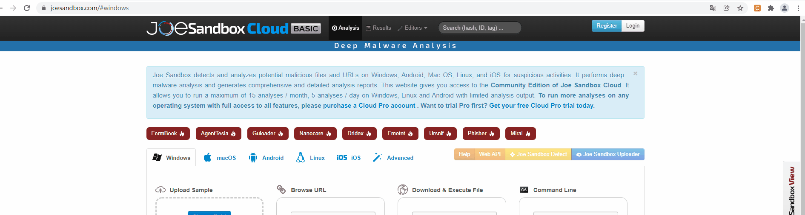
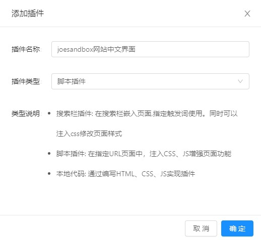
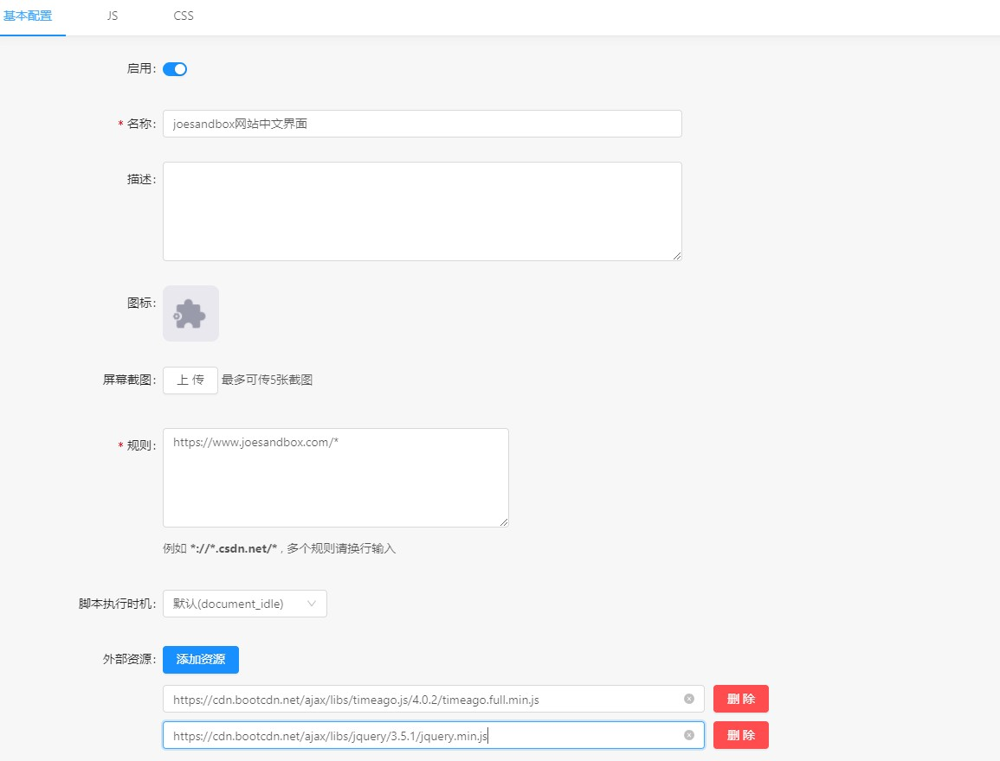
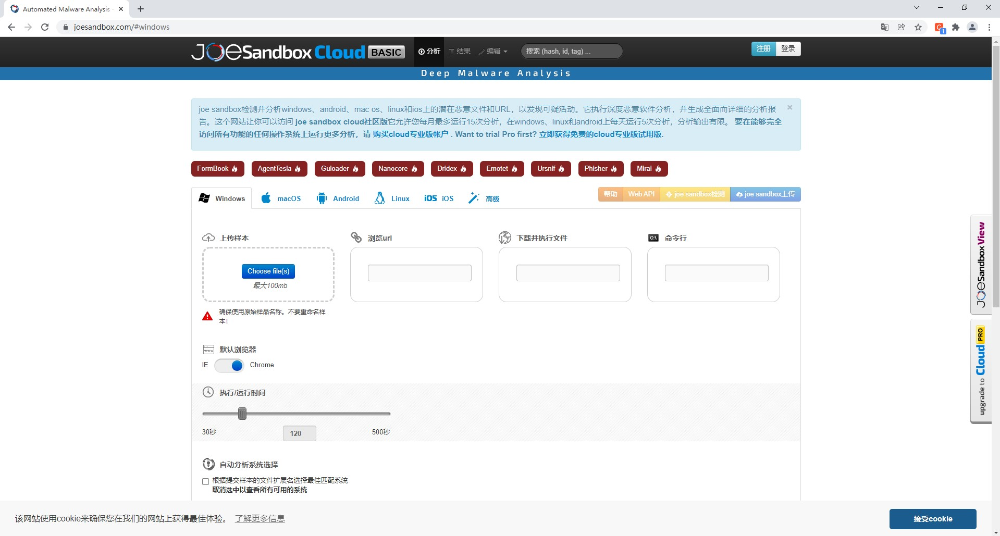

# 因
  在访问一些网站时，发现往往无中文界面，使用翻译器直接翻译效果不是很好，故就有了自己制作中文界面的想法。
# 果
  现使用UserScript脚本方案主要使用JavaScript语言开发，将网站需要翻译的词汇替换成中文已达到中文界面的目的。
  欢迎一起完善，如：
  * 代码优化
  * 解决安全问题
  * 优化翻译词汇
  * 提出新思路
___
# 更新日期
2022年1月12日
# 使用方法
## 脚本管理器：CSDN·浏览器助手插件
* 可去浏览器插件下载或使用官方离线安装包
* 打开CSDN·浏览器助手插件如下选项创建翻译脚本：
进入csdn脚本添加入口方案示例：
1.在访问某个网站时鼠标左键点击CSDN·浏览器助手插件选择扩展脚本-管理面板-插件管理-自定义插件-添加插件

2.打开浏览器插件扩展管理选项，点击CSDN·浏览器助手详细信息-扩展选项--插件管理-自定义插件-添加插件  //不同浏览器名称可能不同

添加插件：
点击添加插件按钮输入如下信息并点击确定
```
插件名称：自定义
插件类型：脚本插件
```
确定后进入插件编辑界面
示例：

* 基本配置
启用：打开
规则：
例如想只让“https://www.joesandbox.com/”这个网站使用此翻译脚本
```
https://www.joesandbox.com/* 
*://www.joesandbox.com/*     //支持所有协议 *通配符
```
外部资源：
点击添加资源按钮，添加如下资源
https://cdn.bootcdn.net/ajax/libs/timeago.js/4.0.2/timeago.full.min.js
https://cdn.bootcdn.net/ajax/libs/jquery/3.5.1/jquery.min.js
其它选项：
根据需求自定义添加
示例：

* js
在项目中找到已制作好的js文件复制其内容复制到js编辑器内并点击保存（需清空源编辑器内容）
示例:https://www.joesandbox.com/网站
在项目中根据域名信息进行搜索（以域名信息创建文件夹内的Corecode.js文件为翻译的核心脚本，复制其内代码）

为方便查找使用，现根据网站类型与域名信息进行分类汇总
* 使用
* 确定创建的脚本已使用后，刷新需使用中文界面的网站
示例：

## 其它使用方案
制作成浏览器插件-待更新
# 参考资料
* GitHub翻译插件-csdn插件应用商店
